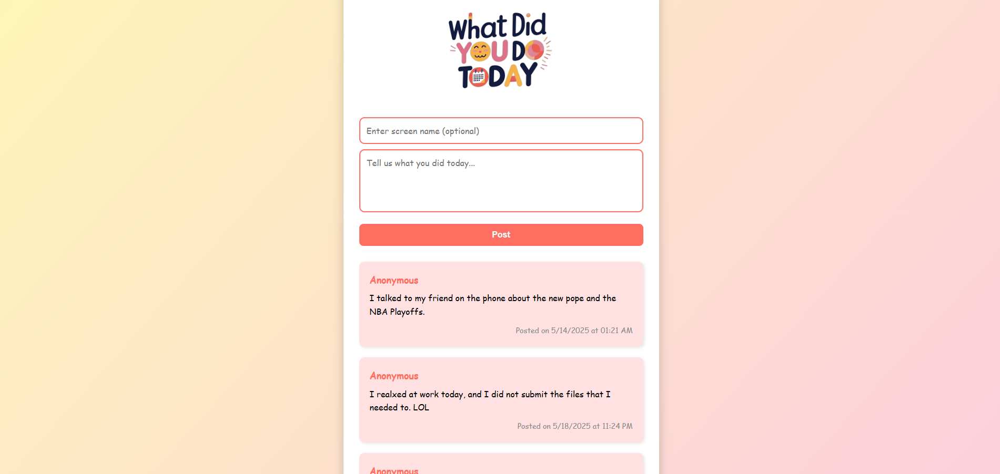

# 📝 What Did You Do Today?

A fun, colorful micro-blogging app where users can post what they did today. Built using Node.js, Express, MongoDB, and EJS templating. Posts are saved to a live database and display in reverse chronological order.

---

## 🚀 Features

- 🌟 Users can optionally enter a screen name (or get auto-assigned one)
- 🗣️ Posts display instantly on the homepage after submission
- 📅 Each post shows the date and time it was added
- 🎨 Friendly Comic Sans UI with fun gradients and animations
- 🛠️ Debug route available at `/debug-posts` to view raw post data (for devs)

---

## 📸 Screenshot



---

## 🧰 Tech Stack

- **Backend:** Node.js, Express
- **Database:** MongoDB Atlas + Mongoose
- **Frontend:** HTML, CSS (Comic Sans styling), EJS
- **Version Control:** Git & GitHub

---

## 🔧 How to Run Locally

1. Clone the repo:
   ```bash
   git clone https://github.com/frontdev17/what-did-you-do-today.git

---

Once pasted, save the file in VS Code and push it to GitHub:

```bash
git add README.md
git commit -m "Add README with project overview"
git push
